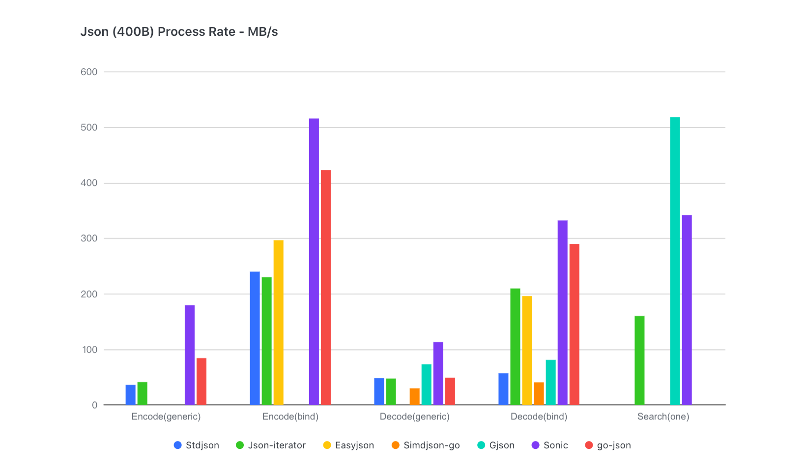
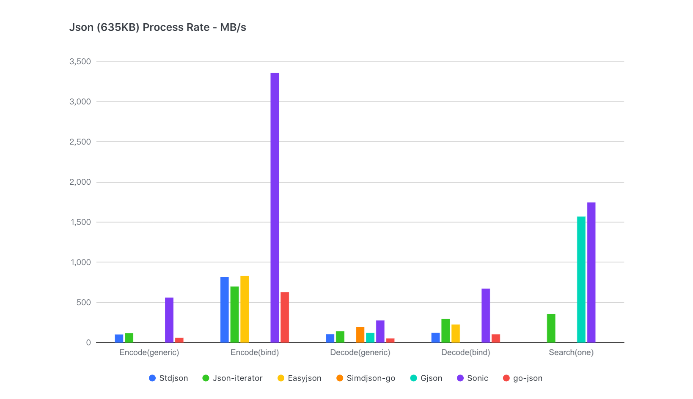

# Sonic

A blazingly fast JSON serializing &amp; deserializing library, accelerated by JIT (just-in-time compiling) and SIMD (single-instruction-multiple-data).

**WARNING: This is still in alpha stage, use with care !**

## Benchmarks
For **all sizes** of json and **all cases** of usage, **Sonic performs best**.
- [Small](https://github.com/bytedance/sonic/blob/main/testdata/small.go) (400B, 11 keys, 3 levels)

- [Large](https://github.com/bytedance/sonic/blob/main/testdata/twitter.json) (635KB, 10000+ key, 6 levels)

- [Medium](https://github.com/bytedance/sonic/blob/main/decoder/testdata_test.go#L19) (13KB, 300+ key, 6 levels)

For a 13KB TwitterJson, Sonic is **1.6x faster** than [json-iterator](https://github.com/json-iterator/go) in `decoding`, **2.7x faster** in `encoding`，**9.6x faster** in `searching`.

```powershell
goos: darwin
goarch: amd64
cpu: Intel(R) Core(TM) i9-9880H CPU @ 2.30GHz
BenchmarkEncoder_Generic_Sonic-16                         100000             27844 ns/op         468.14 MB/s       14332 B/op          4 allocs/op
BenchmarkEncoder_Generic_JsonIter-16                      100000             52179 ns/op         249.81 MB/s       13433 B/op         77 allocs/op
BenchmarkEncoder_Generic_GoJson-16                        100000             47033 ns/op         277.15 MB/s       13129 B/op         39 allocs/op
BenchmarkEncoder_Generic_StdLib-16                        100000            151394 ns/op          86.10 MB/s       48177 B/op        827 allocs/op
BenchmarkEncoder_Binding_Sonic-16                         100000              7338 ns/op        1776.47 MB/s       14492 B/op          4 allocs/op
BenchmarkEncoder_Binding_JsonIter-16                      100000             25365 ns/op         513.90 MB/s        9488 B/op          2 allocs/op
BenchmarkEncoder_Binding_GoJson-16                        100000             10357 ns/op        1258.62 MB/s        9483 B/op          1 allocs/op
BenchmarkEncoder_Binding_StdLib-16                        100000             20258 ns/op         643.44 MB/s        9480 B/op          1 allocs/op
BenchmarkEncoder_Parallel_Generic_Sonic-16                100000              5145 ns/op        2533.58 MB/s       10768 B/op          4 allocs/op
BenchmarkEncoder_Parallel_Generic_JsonIter-16             100000             11436 ns/op        1139.78 MB/s       13451 B/op         77 allocs/op
BenchmarkEncoder_Parallel_Generic_GoJson-16               100000             15274 ns/op         853.43 MB/s       13143 B/op         39 allocs/op
BenchmarkEncoder_Parallel_Generic_StdLib-16               100000             56236 ns/op         231.79 MB/s       48211 B/op        827 allocs/op
BenchmarkEncoder_Parallel_Binding_Sonic-16                100000              1821 ns/op        7159.40 MB/s       11262 B/op          4 allocs/op
BenchmarkEncoder_Parallel_Binding_JsonIter-16             100000              4559 ns/op        2859.24 MB/s        9487 B/op          2 allocs/op
BenchmarkEncoder_Parallel_Binding_GoJson-16               100000              2182 ns/op        5973.36 MB/s        9481 B/op          1 allocs/op
BenchmarkEncoder_Parallel_Binding_StdLib-16               100000              3867 ns/op        3370.58 MB/s        9477 B/op          1 allocs/op

BenchmarkDecoder_Generic_Sonic-16                         100000             61092 ns/op         213.37 MB/s       49761 B/op        317 allocs/op
BenchmarkDecoder_Generic_StdLib-16                        100000            158709 ns/op          82.13 MB/s       50899 B/op        772 allocs/op
BenchmarkDecoder_Generic_JsonIter-16                      100000            113397 ns/op         114.95 MB/s       55789 B/op       1068 allocs/op
BenchmarkDecoder_Generic_GoJson-16                        100000            108711 ns/op         119.91 MB/s       65679 B/op        944 allocs/op
BenchmarkDecoder_Binding_Sonic-16                         100000             32614 ns/op         399.67 MB/s       25174 B/op         38 allocs/op
BenchmarkDecoder_Binding_StdLib-16                        100000            150494 ns/op          86.61 MB/s       10560 B/op        207 allocs/op
BenchmarkDecoder_Binding_JsonIter-16                      100000             43621 ns/op         298.83 MB/s       14674 B/op        385 allocs/op
BenchmarkDecoder_Binding_GoJson-16                        100000             37525 ns/op         347.36 MB/s       22048 B/op         49 allocs/op
BenchmarkDecoder_Parallel_Generic_Sonic-16                100000             10581 ns/op        1231.89 MB/s       49636 B/op        317 allocs/op
BenchmarkDecoder_Parallel_Generic_StdLib-16               100000             67640 ns/op         192.71 MB/s       50909 B/op        772 allocs/op
BenchmarkDecoder_Parallel_Generic_JsonIter-16             100000             60982 ns/op         213.75 MB/s       55809 B/op       1068 allocs/op
BenchmarkDecoder_Parallel_Generic_GoJson-16               100000             51373 ns/op         253.73 MB/s       65718 B/op        945 allocs/op
BenchmarkDecoder_Parallel_Binding_Sonic-16                100000              6995 ns/op        1863.60 MB/s       24890 B/op         38 allocs/op
BenchmarkDecoder_Parallel_Binding_StdLib-16               100000             45269 ns/op         287.94 MB/s       10559 B/op        207 allocs/op
BenchmarkDecoder_Parallel_Binding_JsonIter-16             100000             18416 ns/op         707.82 MB/s       14677 B/op        385 allocs/op
BenchmarkDecoder_Parallel_Binding_GoJson-16               100000             17524 ns/op         743.85 MB/s       22132 B/op         49 allocs/op

BenchmarkSearchOne_Gjson-16                               100000              8812 ns/op        1477.89 MB/s           0 B/op          0 allocs/op
BenchmarkSearchOne_Jsoniter-16                            100000             55845 ns/op         233.20 MB/s       27936 B/op        647 allocs/op
BenchmarkSearchOne_Sonic-16                               100000             10422 ns/op        1249.54 MB/s           0 B/op          0 allocs/op
BenchmarkSearchOne_Parallel_Gjson-16                      100000               955.1 ns/op      13635.35 MB/s          0 B/op          0 allocs/op
BenchmarkSearchOne_Parallel_Jsoniter-16                   100000             18864 ns/op         690.37 MB/s       27942 B/op        647 allocs/op
BenchmarkSearchOne_Parallel_Sonic-16                      100000              1420 ns/op        9171.43 MB/s         234 B/op          0 allocs/op
```        
More detail see [decoder/decoder_test.go](https://github.com/bytedance/sonic/blob/main/decoder/decoder_test.go), [encoder/encoder_test.go](https://github.com/bytedance/sonic/blob/main/encoder/encoder_test.go), [ast/search_test.go](https://github.com/bytedance/sonic/blob/main/ast/search_test.go), [ast/parser_test.go](https://github.com/bytedance/sonic/blob/main/ast/parser_test.go)

## Requirement
- Go 1.15/1.16
- Linux/darwin OS
- Amd64 CPU with AVX/AVX2 instruction set

## Usage

### Marshal/Unmarshal

The behaviors are mostly consistent with encoding/json, except some uncommon escaping and key sorting (see [issue4](https://github.com/bytedance/sonic/issues/4))
 ```go
import "github.com/bytedance/sonic"

// Marshal
output, err := sonic.Marshal(&data) 
// Unmarshal
err := sonic.Unmarshal(input, &data) 
 ```

### Use Number/Use Int64
 ```go
import "github.com/bytedance/sonic/decoder"

input := `1`
var data interface{}

// default float64
dc := decoder.NewDecoder(input) 
dc.Decode(&data) // data == float64(1)
// use json.Number
dc = decoder.NewDecoder(input)
dc.UseNumber()
dc.Decode(&data) // data == json.Number("1")
// use int64
dc = decoder.NewDecoder(input)
dc.UseInt64()
dc.Decode(&data) // data == int64(1)

root, err := sonic.GetFromString(input)
// Get json.Number
jn := root.Number()
jm := root.InterfaceUseNumber().(json.Number) // jn == jm
// Get float64
fn := root.Float64()
fm := root.Interface().(float64) // jn == jm
 ```

### Print Syntax Error
```go
import "github.com/bytedance/sonic/decoder"

var data interface{}
dc := decoder.NewDecoder("[[[}]]")
if err := dc.Decode(&data); err != nil {
    if e, ok := err.(decoder.SyntaxError); ok {
        
        /*Syntax error at index 3: invalid char

            [[[}]]
            ...^..
        */
        print(e.Description())

        /*"Syntax error at index 3: invalid char\n\n\t[[[}]]\n\t...^..\n"*/
        println(fmt.Sprintf("%q", e.Description()))
    }

    /*Decode: Syntax error at index 3: invalid char*/
    t.Fatalf("Decode: %v", err) 
}
```

### Ast.Node

#### Get
Search partial json by given pathes, which must be non-negative integer or string or nil
```go
import "github.com/bytedance/sonic"

input := []byte(`{"key1":[{},{"key2":{"key3":[1,2,3]}}]}`)

// no path, returns entire json
root, err := sonic.Get(input)
raw := root.Raw() // == string(input)

// multiple pathes
root, err := sonic.Get(input, "key1", 1, "key2")
sub := root.Get("key3").Index(2).Int64() // == 3
```

#### Serialize
To encode `ast.Node` as json, use `MarshalJson()` or `json.Marshal()` (MUST pass the node's pointer)
```go
import (
    "encoding/json"
    "github.com/bytedance/sonic"
)

buf, err := root.MarshalJson()
println(string(buf))                //{"key1":[{},{"key2":{"key3":[1,2,3]}}]}
exp, err := json.Marshal(&root)     //WARN: use pointer
println(string(buf) == string(exp)) // true
```

#### Other features
- secondary search: `Get()`, `Index()`, `GetByPath()`
- type assignment: `Int64()`, `Float64()`, `String()`, `Number()`, `Bool()`, `Map()`, `Array()`
- children traversal: `Values()`, `Properties()`
- modification: `Set()`, `SetByIndex()`, `Add()`, `Cap()`, `Len()`

## Tips

### Pretouch
Since Sonic uses [golang-asm](https://github.com/twitchyliquid64/golang-asm) as JIT assembler, which is NOT very suitable for runtime compiling, first-hit running of a huge schema may cause request-timeout or even process-OOM. For better stability, we advise to **use `Pretouch()` for huge-schema or compact-memory application** before `Marshal()/Unmarshal()`.
```go
import (
    "reflect"
    "github.com/bytedance/sonic"
)

func init() {
    var v HugeStruct
    err := sonic.Pretouch(reflect.TypeOf(v))
}
```
**CAUSION:**  use the **STRUCT instead of its POINTER** to `Pretouch()`, otherwish it won't work when you pass the pointer to `Marshal()/Unmarshal()`!  

### Pass string or []byte?
For alignment to encoding/json, we provide API to pass `[]byte` as arguement, but the string-to-bytes copy is conducted at the same time considering safety, which may lose performance when origin json is huge. Therefore, you can use `UnmarshalString`, `GetFromString` to pass string, as long as your origin data is string or **nocopy-cast** is safe for your []byte.

### Avoid repeating work
`Get()` overlapping pathes from the same root may cause repeating parsing. Instead of using `Get()` several times, you can use parser and searcher together like this:
```go
import "github.com/bytedance/sonic"

root, err := sonic.GetFromString(_TwitterJson, "statuses", 3, "user")
a = root.GetByPath( "entities","description")
b = root.GetByPath( "entities","url")
c = root.GetByPath( "created_at")
```
No need to worry about the overlaping or overparsing of a, b and c, because the inner parser of their root is lazy-loaded.
### Better performance for generic deserializing
In most cases of fully-load generic json, `Unmarshal()` performs better than `ast.Loads()`. But if you only want to search a partial json and convert it into `interface{}` (or `map[string]interface{}`, `[]interface{}`), we advise you to combine `Get()` and `Unmarshal()`:
```go
import "github.com/bytedance/sonic"

node, err := sonic.GetFromString(_TwitterJson, "statuses", 3, "user")
var user interface{}
err = sonic.UnmarshalString(node.Raw(), &user)
```
