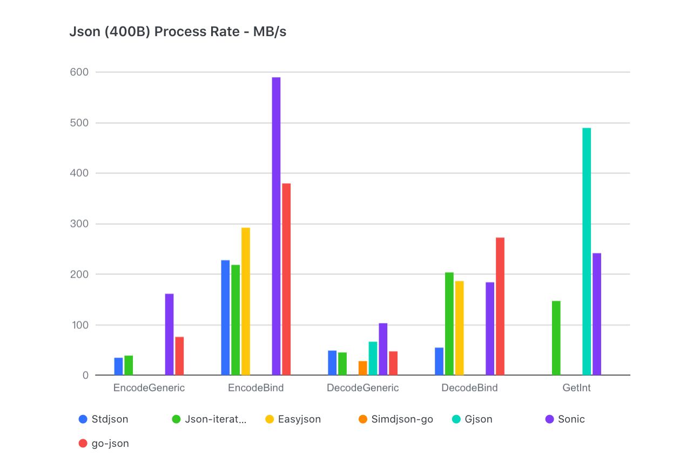
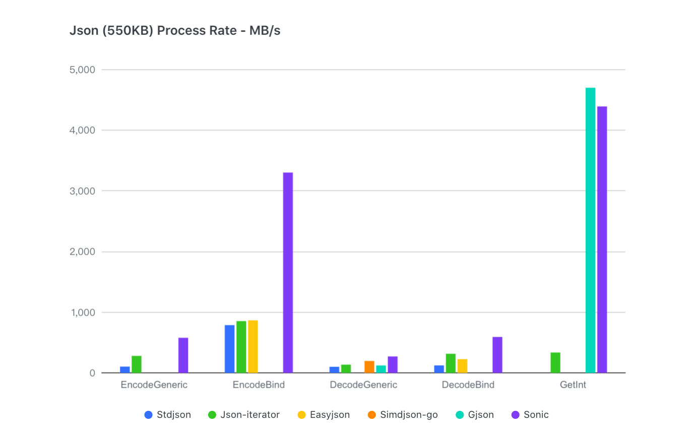

# Sonic

A blazingly fast JSON serializing &amp; deserializing library, accelerated by JIT(just-in-time compiling) and SIMD(single-instruction-multi-data).

**WARNING: This is still in alpha stage, use with care !**

## Benchmarks
For all sizes of json and all scenes of usage, Sonic performs almost best.
- [Small](https://github.com/bytedance/sonic/blob/main/testdata/small.go) (400B, 11 keys, 3 levels)

- [Large](https://github.com/bytedance/sonic/blob/main/testdata/twitterescaped.json) (550KB, 10000+ key, 6 levels)

- [Medium](https://github.com/bytedance/sonic/blob/main/decoder/testdata_test.go#L19) (13KB, 300+ key, 6 levels)
For a 13KB TwitterJson, Sonic is **1.5x** faster than [json-iterator](https://github.com/json-iterator/go) in decoding, **2.5x** faster in encoding.

```powershell
goos: darwin
goarch: amd64
pkg: github.com/bytedance/sonic/encoder
cpu: Intel(R) Core(TM) i9-9880H CPU @ 2.30GHz
BenchmarkEncoder_Generic_Sonic-16                         100000             24174 ns/op         539.22 MB/s       17757 B/op         42 allocs/op
BenchmarkEncoder_Generic_JsonIter-16                      100000             44613 ns/op         292.18 MB/s       13433 B/op         77 allocs/op
BenchmarkEncoder_Generic_GoJson-16                        100000             87898 ns/op         148.30 MB/s       13234 B/op         39 allocs/op
BenchmarkEncoder_Generic_StdLib-16                        100000            133512 ns/op          97.63 MB/s       48177 B/op        827 allocs/op

BenchmarkEncoder_Binding_Sonic-16                         100000              6058 ns/op        2151.73 MB/s       13481 B/op          4 allocs/op
BenchmarkEncoder_Binding_JsonIter-16                      100000             21223 ns/op         614.20 MB/s        9488 B/op          2 allocs/op
BenchmarkEncoder_Binding_GoJson-16                        100000             10186 ns/op        1279.74 MB/s        9480 B/op          1 allocs/op
BenchmarkEncoder_Binding_StdLib-16                        100000             17741 ns/op         734.75 MB/s        9479 B/op          1 allocs/op

BenchmarkDecoder_Generic_Sonic-16                         100000             53344 ns/op         244.36 MB/s       50158 B/op        313 allocs/op
BenchmarkDecoder_Generic_StdLib-16                        100000            141006 ns/op          92.44 MB/s       50898 B/op        772 allocs/op
BenchmarkDecoder_Generic_JsonIter-16                      100000            106386 ns/op         122.53 MB/s       55785 B/op       1068 allocs/op
BenchmarkDecoder_Generic_GoJson-16                        100000            107184 ns/op         121.61 MB/s       65678 B/op        944 allocs/op

BenchmarkDecoder_Binding_Sonic-16                         100000             30039 ns/op         433.94 MB/s       25259 B/op         34 allocs/op
BenchmarkDecoder_Binding_StdLib-16                        100000            131088 ns/op          99.44 MB/s       10560 B/op        207 allocs/op
BenchmarkDecoder_Binding_JsonIter-16                      100000             37988 ns/op         343.13 MB/s       14674 B/op        385 allocs/op
BenchmarkDecoder_Binding_GoJson-16                        100000             33741 ns/op         386.33 MB/s       22047 B/op         49 allocs/op
```
More detail see [decoder/decoder_test.go](https://github.com/bytedance/sonic/blob/main/decoder/decoder_test.go), [encoder/encoder_test.go](https://github.com/bytedance/sonic/blob/main/encoder/encoder_test.go), [ast/search_test.go](https://github.com/bytedance/sonic/blob/main/ast/search_test.go), [ast/parser_test.go](https://github.com/bytedance/sonic/blob/main/ast/parser_test.go)

## Requirement
- Go 1.15/1.16
- Linux/darwin OS
- Amd64 CPU with AVX/AVX2 instruction set

## Usage

### Marshal/Unmarshal

The behaviors are mostly consistent with encoding/json, except some uncommon escaping and key sorting (see [issue4](https://github.com/bytedance/sonic/issues/4))
 ```go
import "github.com/bytedance/sonic"

// Marshal
output, err := sonic.Marshal(&data) 
// Unmarshal
err := sonic.Unmarshal(input, &data) 
 ```

### Get

Search partial json by given pathes, which must be non-negative integer or string or nil
```go
import "github.com/bytedance/sonic"

input := []byte(`{"key1":[{},{"key2":{"key3":[1,2,3]}}]}`)

// no path, returns entire json
root, err := sonic.Get(input)
raw := root.Raw() // == string(input)

// multiple pathes
root, err := sonic.Get(input, "key1", 1, "key2")
sub := root.Get("key3").Index(2).Int64() // == 3
```
Returned ast.Node supports：
- secondary search: `Get()`, `Index()`, `GetByPath()`
- type assignment: `Int64()`, `Float64()`, `String()`, `Number()`, `Bool()`, `Map()`, `Array()`
- children traversal: `Values()`, `Properties()`
- supplement: `Set()`, `SetByIndex()`, `Add()`, `Cap()`, `Len()`

### Use Number/Use Int64
 ```go
import "github.com/bytedance/sonic/decoder"

input := `1`
var data interface{}

// default float64
dc := decoder.NewDecoder(input) 
dc.Decode(&data) // data == float64(1)
// use json.Number
dc = decoder.NewDecoder(input)
dc.UseNumber()
dc.Decode(&data) // data == json.Number("1")
// use int64
dc = decoder.NewDecoder(input)
dc.UseInt64()
dc.Decode(&data) // data == int64(1)

root, err := sonic.GetFromString(input)
// Get json.Number
jn := root.Number()
jm := root.InterfaceUseNumber().(json.Number) // jn == jm
// Get float64
fn := root.Float64()
fm := root.Interface().(float64) // jn == jm
 ```

## Tips

### Pretouch
Since Sonic uses JIT(just-in-time) compiling for decoder/encoder, huge schema may cause request-timeout. For better stability, we suggest to use `Pretouch()` for more-than-10000-field schema(struct) before `Marshal()/Unmarshal()`.
```go
import (
    "reflect"
    "github.com/bytedance/sonic"
)

func init() {
    var v HugeStruct
    err := sonic.Pretouch(reflect.TypeOf(v))
}
```

### Pass string or []byte?
For alignment to encoding/json, we provide API to pass `[]byte` as arguement, but the string-to-bytes copy is conducted at the same time considering safety, which may lose performance when origin json is huge. Therefore, you can use `UnmarshalString`, `GetFromString` to pass string, as long as your origin data is string or **nocopy-cast** is safe for your []byte.

### Avoid repeating work
`Get()` overlapping pathes from the same root may cause repeating parsing. Instead of using `Get()` several times, you can use parser and searcher together like this:
```go
import "github.com/bytedance/sonic"

root, err := sonic.GetFromString(_TwitterJson, "statuses", 3, "user")
a = root.GetByPath( "entities","description")
b = root.GetByPath( "entities","url")
c = root.GetByPath( "created_at")
```
No need to worry about the overlaping or overparsing of a, b and c, because the inner parser of their root is lazy-loaded.
### Better performance for generic deserializing
In most cases of fully-load generic json, `Unmarshal()` performs better than `ast.Loads()`. But if you only want to search a partial json and convert it into `interface{}` (or `map[string]interface{}`, `[]interface{}`), we advise you to combine `Get()` and `Unmarshal()`:
```go
import "github.com/bytedance/sonic"

node, err := sonic.GetFromString(_TwitterJson, "statuses", 3, "user")
var user interface{}
err = sonic.UnmarshalString(node.Raw(), &user)
```
