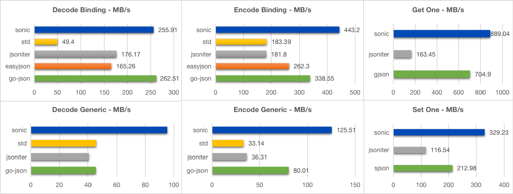
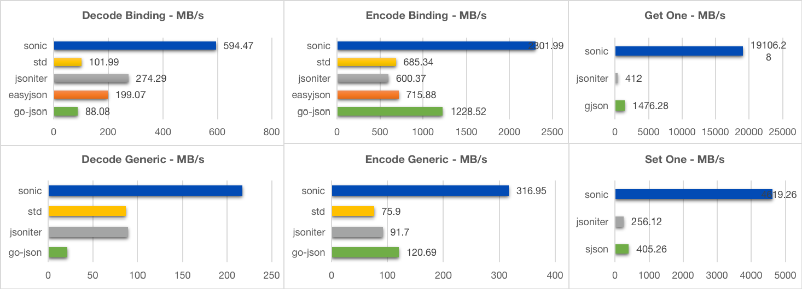

# Sonic

A blazingly fast JSON serializing &amp; deserializing library, accelerated by JIT (just-in-time compiling) and SIMD (single-instruction-multiple-data).

## Requirement
- Go 1.15/1.16
- Linux/darwin OS
- Amd64 CPU with AVX instruction set

## Features
- Runtime object binding without code generation
- Complete APIs for JSON value manipulation
- Fast, fast, fast!

## Benchmarks
For **all sizes** of json and **all cases** of usage, **Sonic performs best**.
- [Small](https://github.com/bytedance/sonic/blob/main/testdata/small.go) (400B, 11 keys, 3 layers)

- [Large](https://github.com/bytedance/sonic/blob/main/testdata/twitter.json) (635KB, 10000+ key, 6 layers)

- [Medium](https://github.com/bytedance/sonic/blob/main/decoder/testdata_test.go#L19) (13KB, 300+ key, 6 layers)

**For medium data, Sonic's speed is `2.6x times` of [json-iterator's](https://github.com/json-iterator/go) in `decoding`, `2.5x times` in `encoding`，and `8.3x times` in `searching`.**

```powershell
goos: darwin
goarch: amd64
cpu: Intel(R) Core(TM) i9-9880H CPU @ 2.30GHz
BenchmarkEncoder_Generic_Sonic-16                         100000             25335 ns/op         514.50 MB/s       13458 B/op          4 allocs/op
BenchmarkEncoder_Generic_JsonIter-16                      100000             44439 ns/op         293.33 MB/s       13434 B/op         77 allocs/op
BenchmarkEncoder_Generic_StdLib-16                        100000            142380 ns/op          91.55 MB/s       48177 B/op        827 allocs/op
BenchmarkEncoder_Binding_Sonic-16                         100000              6664 ns/op        1956.11 MB/s       13639 B/op          4 allocs/op
BenchmarkEncoder_Binding_JsonIter-16                      100000             21978 ns/op         593.09 MB/s        9489 B/op          2 allocs/op
BenchmarkEncoder_Binding_StdLib-16                        100000             18135 ns/op         718.79 MB/s        9479 B/op          1 allocs/op
BenchmarkEncoder_Parallel_Generic_Sonic-16                100000              4461 ns/op        2922.26 MB/s       11031 B/op          4 allocs/op
BenchmarkEncoder_Parallel_Generic_JsonIter-16             100000             11388 ns/op        1144.58 MB/s       13450 B/op         77 allocs/op
BenchmarkEncoder_Parallel_Generic_StdLib-16               100000             52288 ns/op         249.29 MB/s       48218 B/op        827 allocs/op
BenchmarkEncoder_Parallel_Binding_Sonic-16                100000              1372 ns/op        9499.79 MB/s       11209 B/op          4 allocs/op
BenchmarkEncoder_Parallel_Binding_JsonIter-16             100000              5442 ns/op        2395.29 MB/s        9503 B/op          2 allocs/op
BenchmarkEncoder_Parallel_Binding_StdLib-16               100000              3211 ns/op        4060.09 MB/s        9477 B/op          1 allocs/op

BenchmarkDecoder_Generic_Sonic-16                         100000             58558 ns/op         222.60 MB/s       49475 B/op        313 allocs/op
BenchmarkDecoder_Generic_StdLib-16                        100000            152223 ns/op          85.63 MB/s       50897 B/op        772 allocs/op
BenchmarkDecoder_Generic_JsonIter-16                      100000            109287 ns/op         119.27 MB/s       55788 B/op       1068 allocs/op
BenchmarkDecoder_Generic_GoJson-16                        100000            102313 ns/op         127.40 MB/s       65678 B/op        944 allocs/op
BenchmarkDecoder_Binding_Sonic-16                         100000             30693 ns/op         424.69 MB/s       25047 B/op         34 allocs/op
BenchmarkDecoder_Binding_StdLib-16                        100000            135259 ns/op          96.37 MB/s       10560 B/op        207 allocs/op
BenchmarkDecoder_Binding_JsonIter-16                      100000             41359 ns/op         315.17 MB/s       14674 B/op        385 allocs/op
BenchmarkDecoder_Binding_GoJson-16                        100000             34598 ns/op         376.76 MB/s       22047 B/op         49 allocs/op
BenchmarkDecoder_Parallel_Generic_Sonic-16                100000             10081 ns/op        1293.07 MB/s       49693 B/op        313 allocs/op
BenchmarkDecoder_Parallel_Generic_StdLib-16               100000             58396 ns/op         223.22 MB/s       50904 B/op        772 allocs/op
BenchmarkDecoder_Parallel_Generic_JsonIter-16             100000             59009 ns/op         220.90 MB/s       55809 B/op       1068 allocs/op
BenchmarkDecoder_Parallel_Generic_GoJson-16               100000             48077 ns/op         271.13 MB/s       65722 B/op        945 allocs/op
BenchmarkDecoder_Parallel_Binding_Sonic-16                100000              6788 ns/op        1920.27 MB/s       24810 B/op         34 allocs/op
BenchmarkDecoder_Parallel_Binding_StdLib-16               100000             42670 ns/op         305.48 MB/s       10559 B/op        207 allocs/op
BenchmarkDecoder_Parallel_Binding_JsonIter-16             100000             19211 ns/op         678.52 MB/s       14678 B/op        385 allocs/op
BenchmarkDecoder_Parallel_Binding_GoJson-16               100000             18234 ns/op         714.86 MB/s       22167 B/op         49 allocs/op

BenchmarkSearchOne_Gjson-16                               100000              8992 ns/op        1448.28 MB/s           0 B/op          0 allocs/op
BenchmarkSearchOne_Jsoniter-16                            100000             58313 ns/op         223.33 MB/s       27936 B/op        647 allocs/op
BenchmarkSearchOne_Sonic-16                               100000             10497 ns/op        1240.61 MB/s          29 B/op          1 allocs/op
BenchmarkSearchOne_Parallel_Gjson-16                      100000              1046 ns/op        12449.59 MB/s          0 B/op          0 allocs/op
BenchmarkSearchOne_Parallel_Jsoniter-16                   100000             16080 ns/op         809.88 MB/s       27942 B/op        647 allocs/op
BenchmarkSearchOne_Parallel_Sonic-16                      100000              1435 ns/op        9074.18 MB/s         285 B/op          1 allocs/op
```        
More detail see [decoder/decoder_test.go](https://github.com/bytedance/sonic/blob/main/decoder/decoder_test.go), [encoder/encoder_test.go](https://github.com/bytedance/sonic/blob/main/encoder/encoder_test.go), [ast/search_test.go](https://github.com/bytedance/sonic/blob/main/ast/search_test.go), [ast/parser_test.go](https://github.com/bytedance/sonic/blob/main/ast/parser_test.go), [ast/node_test.go](https://github.com/bytedance/sonic/blob/main/ast/node_test.go)

## How it works
See [INTRODUCTION.md](INTRODUCTION.md)

## Fuzzing
[sonic-fuzz](https://github.com/liuq19/sonic-fuzz) is the repository for fuzzing tests. If you find any bug, please report the issue to sonic.

## Usage

### Marshal/Unmarshal

The behaviors are mostly consistent with encoding/json, except some uncommon escaping (see [issue4](https://github.com/bytedance/sonic/issues/4))
 ```go
import "github.com/bytedance/sonic"

var data YourSchema
// Marshal
output, err := sonic.Marshal(&data) 
// Unmarshal
err := sonic.Unmarshal(output, &data) 
 ```

### Use Number/Use Int64
 ```go
import "github.com/bytedance/sonic/decoder"

var input = `1`
var data interface{}

// default float64
dc := decoder.NewDecoder(input) 
dc.Decode(&data) // data == float64(1)
// use json.Number
dc = decoder.NewDecoder(input)
dc.UseNumber()
dc.Decode(&data) // data == json.Number("1")
// use int64
dc = decoder.NewDecoder(input)
dc.UseInt64()
dc.Decode(&data) // data == int64(1)

root, err := sonic.GetFromString(input)
// Get json.Number
jn := root.Number()
jm := root.InterfaceUseNumber().(json.Number) // jn == jm
// Get float64
fn := root.Float64()
fm := root.Interface().(float64) // jn == jm
 ```

### Sort Keys
On account of the performance loss from sorting (roughly 10%), sonic doesn't enable this feature by default. If your component depends on it to work (like [zstd](https://github.com/facebook/zstd)), Use it like this:
```go
import "github.com/bytedance/sonic/encoder"

m := map[string]interface{}{}
v, err := encoder.Encode(m, encoder.SortMapKeys)
```
**Caution**: sonic encode struct in order of its original field declaration, so if you want to sort a struct's keys like the map's, just rewrite your struct. 

### Print Syntax Error
```go
import "github.com/bytedance/sonic/decoder"

var data interface{}
dc := decoder.NewDecoder("[[[}]]")
if err := dc.Decode(&data); err != nil {
    if e, ok := err.(decoder.SyntaxError); ok {
        
        /*Syntax error at index 3: invalid char

            [[[}]]
            ...^..
        */
        print(e.Description())

        /*"Syntax error at index 3: invalid char\n\n\t[[[}]]\n\t...^..\n"*/
        println(fmt.Sprintf("%q", e.Description()))
    }

    /*Decode: Syntax error at index 3: invalid char*/
    t.Fatalf("Decode: %v", err) 
}
```

### Ast.Node
Sonic/ast.Node is a completely self-contained AST for JSON. It implements serialization and deserialization both, and provides robust APIs for obtaining and modification of generic data.
#### Get/Index
Search partial JSON by given paths, which must be non-negative integer or string or nil
```go
import "github.com/bytedance/sonic"

input := []byte(`{"key1":[{},{"key2":{"key3":[1,2,3]}}]}`)

// no path, returns entire json
root, err := sonic.Get(input)
raw := root.Raw() // == string(input)

// multiple pathes
root, err := sonic.Get(input, "key1", 1, "key2")
sub := root.Get("key3").Index(2).Int64() // == 3
```
**Tip**: since `Index()` uses offset to locate data, which is faster much than scanning like `Get()`, we suggest you use it as much as possible. And sonic also provides another API `IndexOrGet()` to underlying use offset as well as ensuring the key is matched.

#### Set/Unset
Modify the json content by Set()/Unset()
```go
import "github.com/bytedance/sonic"

// Set
exist, err := root.Set("key4", NewBool(true)) // exist == false
alias1 := root.Get("key4") 
println(alias1.Valid()) // true
alias2 := root.Index(1)
println(alias1 == alias2) // true

// Unset
exist, err := root.UnsetByIndex(1) // exist == true
println(root.Get("key4").Check()) // "value not exist"
```

#### Serialize
To encode `ast.Node` as json, use `MarshalJson()` or `json.Marshal()` (MUST pass the node's pointer)
```go
import (
    "encoding/json"
    "github.com/bytedance/sonic"
)

buf, err := root.MarshalJson()
println(string(buf))                // {"key1":[{},{"key2":{"key3":[1,2,3]}}]}
exp, err := json.Marshal(&root)     // WARN: use pointer
println(string(buf) == string(exp)) // true
```

#### APIs
- validation: `Check()`, `Error()`, `Valid()`, `Exist()`
- searching: `Index()`, `Get()`, `IndexPair()`, `IndexOrGet()`, `GetByPath()`
- go-type casting: `Int64()`, `Float64()`, `String()`, `Number()`, `Bool()`, `Map[UseNumber|UseNode]()`, `Array[UseNumber|UseNode]()`, `Interface[UseNumber|UseNode]()`
- go-type packing: `NewRaw()`, `NewNumber()`, `NewNull()`, `NewBool()`, `NewString()`, `NewObject()`, `NewArray()`
- iteration: `Values()`, `Properties()`
- modification: `Set()`, `SetByIndex()`, `Add()`, `Cap()`, `Len()`

## Tips

### Pretouch
Since Sonic uses [golang-asm](https://github.com/twitchyliquid64/golang-asm) as a JIT assembler, which is NOT very suitable for runtime compiling, first-hit running of a huge schema may cause request-timeout or even process-OOM. For better stability, we advise to **use `Pretouch()` for huge-schema or compact-memory application** before `Marshal()/Unmarshal()`.
```go
import (
    "reflect"
    "github.com/bytedance/sonic"
)

func init() {
    var v HugeStruct
    err := sonic.Pretouch(reflect.TypeOf(v))
}
```
**CAUTION:**  use the **STRUCT instead of its POINTER** to `Pretouch()`, otherwise it won't work when you pass the pointer to `Marshal()/Unmarshal()`!  

### Pass string or []byte?
For alignment to encoding/json, we provide API to pass `[]byte` as argument, but the string-to-bytes copy is conducted at the same time considering safety, which may lose performance when origin JSON is huge. Therefore, you can use `UnmarshalString`, `GetFromString` to pass a string, as long as your origin data is a string or **nocopy-cast** is safe for your []byte.

### Better performance for generic deserializing
In most cases, `Unmarshal()` with schemalized data performs better than `ast.Loads()`/`node.Interface()` with generic data. But if you only have a schema for partial json, you can combine `Get()` and `Unmarshal()` together:
```go
import "github.com/bytedance/sonic"

node, err := sonic.GetFromString(_TwitterJson, "statuses", 3, "user")
var user User // your partial schema...
err = sonic.UnmarshalString(node.Raw(), &user)
```
Even if you don't have any schema, Use `InterfaceUseNode()` as the container of generic values instead of `Map()` or `Interface()`:
```go
import "github.com/bytedance/sonic"

node, err := sonic.GetFromString(_TwitterJson, "statuses", 3, "user")
user := node.InterfaceUseNode() // use node.Interface() as little as possible
```
Why?
1. using `Interface()` means Sonic must parse all the underlying values, while in most cases you only need several of them;
2. `map[x]` is not efficient enough compared to `array[x]`, but `ast.Node` can use `Index()`, for either array or object node;
3. `map`'s performance degrades a lot once rehashing triggered, but `ast.Node` doesn't has this concern;