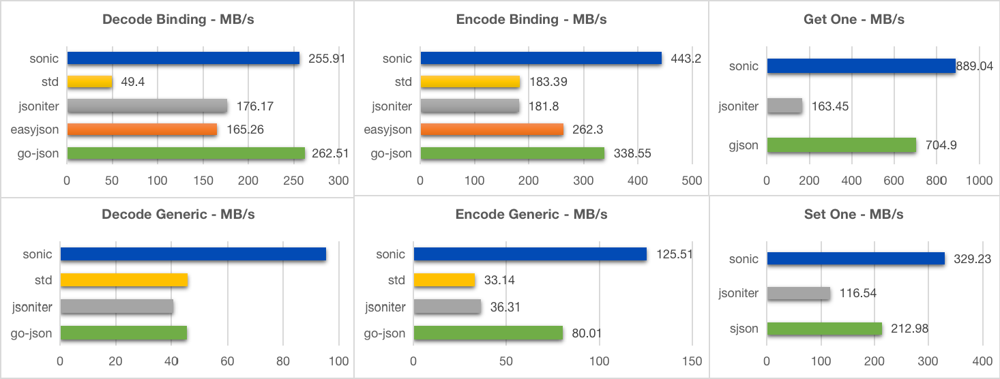
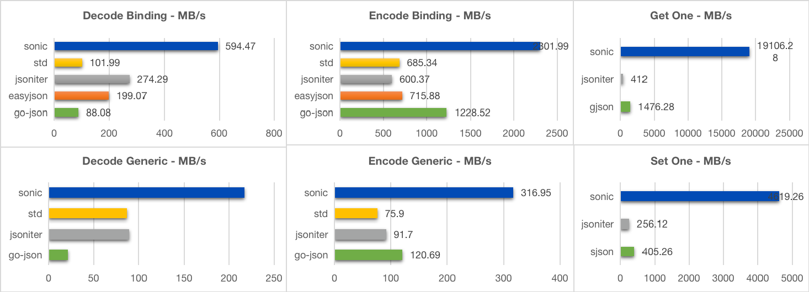

# Sonic

[English](README.md) | [中文](README_ZH_CN.md) | 日本語

JIT（ジャストインタイムコンパイル）と SIMD（単一命令複数データ）によって高速化された、爆速の JSON シリアライズ／デシリアライズライブラリです。

## 必要環境

- Go: 1.18〜1.26
  - 注意: Go1.24.0 は [issue](https://github.com/golang/go/issues/71672) によりサポートされていません。より新しい Go バージョンを使用するか、ビルドフラグ `-ldflags="-checklinkname=0"` を指定してください。
- OS: Linux / MacOS / Windows
- CPU: AMD64 / (ARM64 は go1.20 以上が必要)

## 機能

- コード生成不要のランタイムオブジェクトバインディング
- JSON 値操作のための完全な API
- とにかく高速！

## API

[go.dev](https://pkg.go.dev/github.com/bytedance/sonic) を参照してください。

## ベンチマーク

**あらゆるサイズ**の JSON と**あらゆる利用シーン**において、**Sonic は最高のパフォーマンス**を発揮します。

- [Medium](https://github.com/bytedance/sonic/blob/main/decoder/testdata_test.go#L19) (13KB、300以上のキー、6階層)

```powershell
goversion: 1.17.1
goos: darwin
goarch: amd64
cpu: Intel(R) Core(TM) i9-9880H CPU @ 2.30GHz
BenchmarkEncoder_Generic_Sonic-16                      32393 ns/op         402.40 MB/s       11965 B/op          4 allocs/op
BenchmarkEncoder_Generic_Sonic_Fast-16                 21668 ns/op         601.57 MB/s       10940 B/op          4 allocs/op
BenchmarkEncoder_Generic_JsonIter-16                   42168 ns/op         309.12 MB/s       14345 B/op        115 allocs/op
BenchmarkEncoder_Generic_GoJson-16                     65189 ns/op         199.96 MB/s       23261 B/op         16 allocs/op
BenchmarkEncoder_Generic_StdLib-16                    106322 ns/op         122.60 MB/s       49136 B/op        789 allocs/op
BenchmarkEncoder_Binding_Sonic-16                       6269 ns/op        2079.26 MB/s       14173 B/op          4 allocs/op
BenchmarkEncoder_Binding_Sonic_Fast-16                  5281 ns/op        2468.16 MB/s       12322 B/op          4 allocs/op
BenchmarkEncoder_Binding_JsonIter-16                   20056 ns/op         649.93 MB/s        9488 B/op          2 allocs/op
BenchmarkEncoder_Binding_GoJson-16                      8311 ns/op        1568.32 MB/s        9481 B/op          1 allocs/op
BenchmarkEncoder_Binding_StdLib-16                     16448 ns/op         792.52 MB/s        9479 B/op          1 allocs/op
BenchmarkEncoder_Parallel_Generic_Sonic-16              6681 ns/op        1950.93 MB/s       12738 B/op          4 allocs/op
BenchmarkEncoder_Parallel_Generic_Sonic_Fast-16         4179 ns/op        3118.99 MB/s       10757 B/op          4 allocs/op
BenchmarkEncoder_Parallel_Generic_JsonIter-16           9861 ns/op        1321.84 MB/s       14362 B/op        115 allocs/op
BenchmarkEncoder_Parallel_Generic_GoJson-16            18850 ns/op         691.52 MB/s       23278 B/op         16 allocs/op
BenchmarkEncoder_Parallel_Generic_StdLib-16            45902 ns/op         283.97 MB/s       49174 B/op        789 allocs/op
BenchmarkEncoder_Parallel_Binding_Sonic-16              1480 ns/op        8810.09 MB/s       13049 B/op          4 allocs/op
BenchmarkEncoder_Parallel_Binding_Sonic_Fast-16         1209 ns/op        10785.23 MB/s      11546 B/op          4 allocs/op
BenchmarkEncoder_Parallel_Binding_JsonIter-16           6170 ns/op        2112.58 MB/s        9504 B/op          2 allocs/op
BenchmarkEncoder_Parallel_Binding_GoJson-16             3321 ns/op        3925.52 MB/s        9496 B/op          1 allocs/op
BenchmarkEncoder_Parallel_Binding_StdLib-16             3739 ns/op        3486.49 MB/s        9480 B/op          1 allocs/op

BenchmarkDecoder_Generic_Sonic-16                      66812 ns/op         195.10 MB/s       57602 B/op        723 allocs/op
BenchmarkDecoder_Generic_Sonic_Fast-16                 54523 ns/op         239.07 MB/s       49786 B/op        313 allocs/op
BenchmarkDecoder_Generic_StdLib-16                    124260 ns/op         104.90 MB/s       50869 B/op        772 allocs/op
BenchmarkDecoder_Generic_JsonIter-16                   91274 ns/op         142.81 MB/s       55782 B/op       1068 allocs/op
BenchmarkDecoder_Generic_GoJson-16                     88569 ns/op         147.17 MB/s       66367 B/op        973 allocs/op
BenchmarkDecoder_Binding_Sonic-16                      32557 ns/op         400.38 MB/s       28302 B/op        137 allocs/op
BenchmarkDecoder_Binding_Sonic_Fast-16                 28649 ns/op         455.00 MB/s       24999 B/op         34 allocs/op
BenchmarkDecoder_Binding_StdLib-16                    111437 ns/op         116.97 MB/s       10576 B/op        208 allocs/op
BenchmarkDecoder_Binding_JsonIter-16                   35090 ns/op         371.48 MB/s       14673 B/op        385 allocs/op
BenchmarkDecoder_Binding_GoJson-16                     28738 ns/op         453.59 MB/s       22039 B/op         49 allocs/op
BenchmarkDecoder_Parallel_Generic_Sonic-16             12321 ns/op        1057.91 MB/s       57233 B/op        723 allocs/op
BenchmarkDecoder_Parallel_Generic_Sonic_Fast-16        10644 ns/op        1224.64 MB/s       49362 B/op        313 allocs/op
BenchmarkDecoder_Parallel_Generic_StdLib-16            57587 ns/op         226.35 MB/s       50874 B/op        772 allocs/op
BenchmarkDecoder_Parallel_Generic_JsonIter-16          38666 ns/op         337.12 MB/s       55789 B/op       1068 allocs/op
BenchmarkDecoder_Parallel_Generic_GoJson-16            30259 ns/op         430.79 MB/s       66370 B/op        974 allocs/op
BenchmarkDecoder_Parallel_Binding_Sonic-16              5965 ns/op        2185.28 MB/s       27747 B/op        137 allocs/op
BenchmarkDecoder_Parallel_Binding_Sonic_Fast-16         5170 ns/op        2521.31 MB/s       24715 B/op         34 allocs/op
BenchmarkDecoder_Parallel_Binding_StdLib-16            27582 ns/op         472.58 MB/s       10576 B/op        208 allocs/op
BenchmarkDecoder_Parallel_Binding_JsonIter-16          13571 ns/op         960.51 MB/s       14685 B/op        385 allocs/op
BenchmarkDecoder_Parallel_Binding_GoJson-16            10031 ns/op        1299.51 MB/s       22111 B/op         49 allocs/op

BenchmarkGetOne_Sonic-16                                3276 ns/op        3975.78 MB/s          24 B/op          1 allocs/op
BenchmarkGetOne_Gjson-16                                9431 ns/op        1380.81 MB/s           0 B/op          0 allocs/op
BenchmarkGetOne_Jsoniter-16                            51178 ns/op         254.46 MB/s       27936 B/op        647 allocs/op
BenchmarkGetOne_Parallel_Sonic-16                      216.7 ns/op       60098.95 MB/s          24 B/op          1 allocs/op
BenchmarkGetOne_Parallel_Gjson-16                       1076 ns/op        12098.62 MB/s          0 B/op          0 allocs/op
BenchmarkGetOne_Parallel_Jsoniter-16                   17741 ns/op         734.06 MB/s       27945 B/op        647 allocs/op
BenchmarkSetOne_Sonic-16                               9571 ns/op         1360.61 MB/s        1584 B/op         17 allocs/op
BenchmarkSetOne_Sjson-16                               36456 ns/op         357.22 MB/s       52180 B/op          9 allocs/op
BenchmarkSetOne_Jsoniter-16                            79475 ns/op         163.86 MB/s       45862 B/op        964 allocs/op
BenchmarkSetOne_Parallel_Sonic-16                      850.9 ns/op       15305.31 MB/s        1584 B/op         17 allocs/op
BenchmarkSetOne_Parallel_Sjson-16                      18194 ns/op         715.77 MB/s       52247 B/op          9 allocs/op
BenchmarkSetOne_Parallel_Jsoniter-16                   33560 ns/op         388.05 MB/s       45892 B/op        964 allocs/op
BenchmarkLoadNode/LoadAll()-16                         11384 ns/op        1143.93 MB/s        6307 B/op         25 allocs/op
BenchmarkLoadNode_Parallel/LoadAll()-16                 5493 ns/op        2370.68 MB/s        7145 B/op         25 allocs/op
BenchmarkLoadNode/Interface()-16                       17722 ns/op         734.85 MB/s       13323 B/op         88 allocs/op
BenchmarkLoadNode_Parallel/Interface()-16              10330 ns/op        1260.70 MB/s       15178 B/op         88 allocs/op
```

- [Small](https://github.com/bytedance/sonic/blob/main/testdata/small.go) (400B、11キー、3階層)

- [Large](https://github.com/bytedance/sonic/blob/main/testdata/twitter.json) (635KB、10000以上のキー、6階層)


ベンチマークコードについては [bench.sh](https://github.com/bytedance/sonic/blob/main/scripts/bench.sh) を参照してください。

## 仕組み

[INTRODUCTION.md](./docs/INTRODUCTION.md) を参照してください。

## 使い方

### Marshal/Unmarshal

デフォルトの動作はほとんど `encoding/json` と一致していますが、HTML エスケープ形式（[Escape HTML](https://github.com/bytedance/sonic/blob/main/README.md#escape-html) を参照）および `SortKeys` 機能（[Sort Keys](https://github.com/bytedance/sonic/blob/main/README.md#sort-keys) を参照、オプショナルサポート）は [RFC8259](https://datatracker.ietf.org/doc/html/rfc8259) に**準拠していません**。

 ```go
import "github.com/bytedance/sonic"

var data YourSchema
// Marshal
output, err := sonic.Marshal(&data)
// Unmarshal
err := sonic.Unmarshal(output, &data)
 ```

### ストリーミング IO

Sonic は `io.Reader` からの JSON デコードや、オブジェクトの `io.Writer` へのエンコードをサポートしており、複数の値を扱いながらメモリ消費を抑えることを目的としています。

- encoder

```go
var o1 = map[string]interface{}{
    "a": "b",
}
var o2 = 1
var w = bytes.NewBuffer(nil)
var enc = sonic.ConfigDefault.NewEncoder(w)
enc.Encode(o1)
enc.Encode(o2)
fmt.Println(w.String())
// Output:
// {"a":"b"}
// 1
```

- decoder

```go
var o =  map[string]interface{}{}
var r = strings.NewReader(`{"a":"b"}{"1":"2"}`)
var dec = sonic.ConfigDefault.NewDecoder(r)
dec.Decode(&o)
dec.Decode(&o)
fmt.Printf("%+v", o)
// Output:
// map[1:2 a:b]
```

### Use Number/Use Int64

 ```go
import "github.com/bytedance/sonic/decoder"

var input = `1`
var data interface{}

// デフォルトは float64
dc := decoder.NewDecoder(input)
dc.Decode(&data) // data == float64(1)
// json.Number を使用
dc = decoder.NewDecoder(input)
dc.UseNumber()
dc.Decode(&data) // data == json.Number("1")
// int64 を使用
dc = decoder.NewDecoder(input)
dc.UseInt64()
dc.Decode(&data) // data == int64(1)

root, err := sonic.GetFromString(input)
// json.Number を取得
jn := root.Number()
jm := root.InterfaceUseNumber().(json.Number) // jn == jm
// float64 を取得
fn := root.Float64()
fm := root.Interface().(float64) // jn == jm
 ```

### キーのソート

ソートに伴うパフォーマンス低下（おおよそ 10%）を考慮し、sonic ではこの機能をデフォルトで有効にしていません。コンポーネントの動作にこの機能が必要な場合（[zstd](https://github.com/facebook/zstd) など）、次のように使用してください:

```go
import "github.com/bytedance/sonic"
import "github.com/bytedance/sonic/encoder"

// map のみのバインディング
m := map[string]interface{}{}
v, err := encoder.Encode(m, encoder.SortMapKeys)

// または marshal 前に ast.Node.SortKeys() を呼ぶ
var root := sonic.Get(JSON)
err := root.SortKeys()
```

### HTML エスケープ

パフォーマンス低下（おおよそ 15%）を考慮し、sonic ではこの機能をデフォルトで有効にしていません。`encoder.EscapeHTML` オプションを使うことでこの機能を有効化できます（`encoding/json.HTMLEscape` と整合）。

```go
import "github.com/bytedance/sonic"

v := map[string]string{"&&":"<>"}
ret, err := Encode(v, EscapeHTML) // ret == `{"&&":{"X":"<>"}}`
```

### コンパクトフォーマット

Sonic はデフォルトでプリミティブなオブジェクト（struct/map など）をコンパクト形式の JSON としてエンコードしますが、`json.RawMessage` や `json.Marshaler` を marshal する場合は例外です。sonic はこれらの出力 JSON のバリデーションを行いますが、パフォーマンス上の理由から**コンパクト化は行いません**。コンパクト化処理を加えるために `encoder.CompactMarshaler` オプションを提供しています。

### エラー出力

入力 JSON に構文エラーがある場合、sonic は `decoder.SyntaxError` を返します。これはエラー位置のきれいな表示をサポートしています。

```go
import "github.com/bytedance/sonic"
import "github.com/bytedance/sonic/decoder"

var data interface{}
err := sonic.UnmarshalString("[[[}]]", &data)
if err != nil {
    /* デフォルトでは 1 行 */
    println(e.Error()) // "Syntax error at index 3: invalid char\n\n\t[[[}]]\n\t...^..\n"
    /* きれいに出力 */
    if e, ok := err.(decoder.SyntaxError); ok {
        /*Syntax error at index 3: invalid char

            [[[}]]
            ...^..
        */
        print(e.Description())
    } else if me, ok := err.(*decoder.MismatchTypeError); ok {
        // decoder.MismatchTypeError は Sonic v1.6.0 で追加されました
        print(me.Description())
    }
}
```

#### 型の不一致 [Sonic v1.6.0]

指定したキーに対して**型が一致しない**値があった場合、sonic は `decoder.MismatchTypeError` を報告します（複数ある場合は最後のものを報告）。ただし、誤った値はスキップし、次の JSON のデコードを続行します。

```go
import "github.com/bytedance/sonic"
import "github.com/bytedance/sonic/decoder"

var data = struct{
    A int
    B int
}{}
err := UnmarshalString(`{"A":"1","B":1}`, &data)
println(err.Error())    // Mismatch type int with value string "at index 5: mismatched type with value\n\n\t{\"A\":\"1\",\"B\":1}\n\t.....^.........\n"
fmt.Printf("%+v", data) // {A:0 B:1}
```

### Ast.Node

Sonic/ast.Node は JSON のための完全に自己完結した AST です。シリアライズとデシリアライズの両方を実装し、汎用データの取得と変更のための堅牢な API を提供します。

#### Get/Index

指定したパスで JSON の一部を検索します。パスは非負整数または文字列、もしくは nil でなければなりません。

```go
import "github.com/bytedance/sonic"

input := []byte(`{"key1":[{},{"key2":{"key3":[1,2,3]}}]}`)

// パスなしの場合、JSON 全体を返す
root, err := sonic.Get(input)
raw := root.Raw() // == string(input)

// 複数のパス
root, err := sonic.Get(input, "key1", 1, "key2")
sub := root.Get("key3").Index(2).Int64() // == 3
```

**ヒント**: `Index()` はデータの場所をオフセットで特定するため、`Get()` のようなスキャン処理よりはるかに高速です。可能な限り使用することをお勧めします。また sonic は、オフセットを使いつつキーの一致も保証する `IndexOrGet()` API も提供しています。

#### SearchOption

`Searcher` は、ユーザーのさまざまなニーズに応えるためのオプションを提供しています:

```go
opts := ast.SearchOption{ CopyReturn: true ... }
val, err := sonic.GetWithOptions(JSON, opts, "key")
```

- CopyReturn
入力から参照するのではなく、結果の JSON 文字列をコピーするように searcher に指示します。結果をキャッシュする場合のメモリ使用量を削減するのに役立ちます。
- ConcurentRead
`ast.Node` は `Lazy-Load` 設計を採用しているため、デフォルトでは並行読み取りをサポートしていません。並行読み取りを行いたい場合はこのオプションを指定してください。
- ValidateJSON
JSON 全体を検証するように searcher に指示します。このオプションはデフォルトで有効になっており、検索速度が若干低下します。

#### Set/Unset

Set()/Unset() で JSON コンテンツを変更します。

```go
import "github.com/bytedance/sonic"

// Set
exist, err := root.Set("key4", NewBool(true)) // exist == false
alias1 := root.Get("key4")
println(alias1.Valid()) // true
alias2 := root.Index(1)
println(alias1 == alias2) // true

// Unset
exist, err := root.UnsetByIndex(1) // exist == true
println(root.Get("key4").Check()) // "value not exist"
```

#### シリアライズ

`ast.Node` を JSON としてエンコードするには、`MarshalJson()` または `json.Marshal()`（必ずノードのポインタを渡す）を使用してください。

```go
import (
    "encoding/json"
    "github.com/bytedance/sonic"
)

buf, err := root.MarshalJson()
println(string(buf))                // {"key1":[{},{"key2":{"key3":[1,2,3]}}]}
exp, err := json.Marshal(&root)     // 警告: ポインタを使用すること
println(string(buf) == string(exp)) // true
```

#### API

- バリデーション: `Check()`, `Error()`, `Valid()`, `Exist()`
- 検索: `Index()`, `Get()`, `IndexPair()`, `IndexOrGet()`, `GetByPath()`
- Go 型への変換: `Int64()`, `Float64()`, `String()`, `Number()`, `Bool()`, `Map[UseNumber|UseNode]()`, `Array[UseNumber|UseNode]()`, `Interface[UseNumber|UseNode]()`
- Go 型のパッキング: `NewRaw()`, `NewNumber()`, `NewNull()`, `NewBool()`, `NewString()`, `NewObject()`, `NewArray()`
- イテレーション: `Values()`, `Properties()`, `ForEach()`, `SortKeys()`
- 変更: `Set()`, `SetByIndex()`, `Add()`

### Ast.Visitor

Sonic は、中間表現（`ast.Node` や `interface{}`）を一切使用せずに、JSON を非標準的な型（`struct` でも `map[string]interface{}` でもない型）に完全にパースするための高度な API を提供しています。例えば、`interface{}` のように見えて実際には `interface{}` ではない、以下のような型があるとします:

```go
type UserNode interface {}

// 以下の型は UserNode インターフェースを実装します。
type (
    UserNull    struct{}
    UserBool    struct{ Value bool }
    UserInt64   struct{ Value int64 }
    UserFloat64 struct{ Value float64 }
    UserString  struct{ Value string }
    UserObject  struct{ Value map[string]UserNode }
    UserArray   struct{ Value []UserNode }
)
```

Sonic は、**JSON AST の行きがけ順走査**を返す以下の API を提供しています。`ast.Visitor` は SAX スタイルのインターフェースで、一部の C++ JSON ライブラリで使われているものです。`ast.Visitor` は自分自身で実装し、`ast.Preorder()` メソッドに渡す必要があります。visitor 内で JSON 値を表すカスタム型を作成できます。オブジェクトや配列の階層構造を記録するため、O(n) 容量のコンテナ（スタックなど）が必要になることがあります。

```go
func Preorder(str string, visitor Visitor, opts *VisitorOptions) error

type Visitor interface {
    OnNull() error
    OnBool(v bool) error
    OnString(v string) error
    OnInt64(v int64, n json.Number) error
    OnFloat64(v float64, n json.Number) error
    OnObjectBegin(capacity int) error
    OnObjectKey(key string) error
    OnObjectEnd() error
    OnArrayBegin(capacity int) error
    OnArrayEnd() error
}
```

詳しい使い方は [ast/visitor.go](https://github.com/bytedance/sonic/blob/main/ast/visitor.go) を参照してください。`UserNode` 用のデモ visitor も [ast/visitor_test.go](https://github.com/bytedance/sonic/blob/main/ast/visitor_test.go) で実装しています。

## 互換性

sonic をさまざまなシーンで使いたい開発者向けに、`sonic.API` として統合済みのいくつかの設定を提供しています:

- `ConfigDefault`: sonic のデフォルト設定（`EscapeHTML=false`、`SortKeys=false` など）。安全性を確保しつつ高速に動作します。
- `ConfigStd`: 標準ライブラリ互換の設定（`EscapeHTML=true`、`SortKeys=true` など）。
- `ConfigFastest`: 最も高速な設定（`NoQuoteTextMarshaler=true`）で sonic を可能な限り速く動作させます。
高性能コード開発の難しさから、Sonic はすべての環境をサポートできるわけ**ではありません**。sonic 非対応の環境では、実装は `encoding/json` にフォールバックします。したがって、以下のすべての設定は `ConfigStd` と同じになります。

## ヒント

### Pretouch

Sonic は JIT アセンブラとして [golang-asm](https://github.com/twitchyliquid64/golang-asm) を使用しており、これは実行時コンパイルにあまり適していません。そのため、巨大なスキーマを初回実行する際に、リクエストタイムアウトやプロセスの OOM を引き起こす可能性があります。安定性を高めるため、**巨大なスキーマやレイテンシに敏感なアプリケーションでは `Marshal()/Unmarshal()` の前に `PretouchMany()` を使用する**ことをお勧めします。

```go
import (
    "reflect"
    "github.com/bytedance/sonic"
    "github.com/bytedance/sonic/option"
)

func init() {
    var v1 HugeStruct1
    var v2 HugeStruct2

    // ほとんどの大きな型について（ネスト深度 <= option.DefaultMaxInlineDepth）
    sonic.PretouchMany([]reflect.Type{reflect.TypeOf(v1), reflect.TypeOf(v2)},
        // 型が深くネストしている場合（ネスト深度 > option.DefaultMaxInlineDepth）、
        // 十分な JIT を行うために Pretouch でより多くの再帰ループを設定できます。
        option.WithCompileRecursiveDepth(loop),
        // 大きな構造体については、コンパイル時間を短縮するため、より小さい深度を設定してみてください。
        option.WithCompileMaxInlineDepth(depth),
    )
}
```

### 文字列のコピー

**エスケープ文字を含まない文字列値**をデコードする際、sonic は新しいバッファを malloc してコピーするのではなく、元の JSON バッファから参照します。これは CPU パフォーマンス上大きな助けになりますが、デコードしたオブジェクトを使用している限り、JSON バッファ全体がメモリに残る可能性があります。実際の運用では、JSON バッファを参照することによる追加メモリは、通常デコードしたオブジェクトの 20%〜80% になります。アプリケーションがこれらのオブジェクトを長時間保持する場合（たとえばデコードしたオブジェクトを再利用のためにキャッシュする場合など）、サーバーの使用中メモリが増加することがあります。- `Config.CopyString`/`decoder.CopyString()`: JSON バッファを参照しないことを選択できるオプションを `Decode()` / `Unmarshal()` ユーザー向けに提供しています。ただし、ある程度の CPU パフォーマンス低下を伴うことがあります。

- `GetFromStringNoCopy()`: メモリ安全性のため、`sonic.Get()` / `sonic.GetFromString()` は現在、返す JSON をコピーします。ユーザーがメモリ使用量を気にせず、より高速に JSON を取得したい場合、`GetFromStringNoCopy()` を使ってソースから直接参照される JSON を返すことができます。

### string と []byte のどちらを渡す？

`encoding/json` との整合のため、引数として `[]byte` を渡す API を提供していますが、安全性を考慮して string から bytes へのコピーが同時に行われます。元の JSON が巨大な場合、これはパフォーマンスの低下につながる可能性があります。そのため、元のデータが文字列であるか、**nocopy-cast** が []byte にとって安全である場合は、`UnmarshalString()` や `GetFromString()` を使って文字列を渡すことができます。エンコードされた JSON []byte の便利な **nocopy-cast** のために `MarshalString()` API も提供しています。sonic の出力バイトは常に複製され一意であるため、これは安全です。

### `encoding.TextMarshaler` の高速化

データの安全性を確保するため、sonic.Encoder はデフォルトで `encoding.TextMarshaler` インターフェースからの文字列値をクォートおよびエスケープします。データの大部分がこの形式の場合、パフォーマンスが大幅に低下する可能性があります。これらの操作をスキップするため `encoder.NoQuoteTextMarshaler` を提供していますが、出力文字列が [RFC8259](https://datatracker.ietf.org/doc/html/rfc8259) に従ってエスケープおよびクォートされていることを**必ず**保証する必要があります。

### 汎用データに対するより良いパフォーマンス

**完全パース**のシナリオでは、`Unmarshal()` は `Get()`+`Node.Interface()` よりもパフォーマンスが良いです。しかし、特定の JSON に対するスキーマの一部しか持っていない場合、`Get()` と `Unmarshal()` を組み合わせることができます:

```go
import "github.com/bytedance/sonic"

node, err := sonic.GetFromString(_TwitterJson, "statuses", 3, "user")
var user User // 部分的なスキーマ...
err = sonic.UnmarshalString(node.Raw(), &user)
```

スキーマが全くない場合でも、`map` や `interface` の代わりに `ast.Node` を汎用値のコンテナとして使用してください:

```go
import "github.com/bytedance/sonic"

root, err := sonic.GetFromString(_TwitterJson)
user := root.GetByPath("statuses", 3, "user")  // === root.Get("status").Index(3).Get("user")
err = user.Check()

// err = user.LoadAll() // 'user' を並行で使用したい場合のみこれを呼びます...
go someFunc(user)
```

なぜでしょうか？ `ast.Node` は子要素を `array` で保存するためです:

- データを挿入（デシリアライズ）したりスキャン（シリアライズ）したりする際、`Array` のパフォーマンスは `Map` よりも**遥かに優れています**;
- **ハッシュ計算**（`map[x]`）は**インデックス参照**（`array[x]`）ほど効率的ではなく、`ast.Node` は**配列とオブジェクトの両方**でインデックス参照を行えます;
- `Interface()`/`Map()` を使用すると Sonic はすべての基底値をパースする必要がありますが、`ast.Node` は**必要に応じて**それらをパースできます。

**注意:** `ast.Node` は**遅延ロード**の設計のため、並行安全性を直接保証する**ことはありません**。ただし、`Node.Load()`/`Node.LoadAll()` を呼ぶことで並行安全性を実現できます。これによりパフォーマンスは低下しますが、`map` や `interface{}` に変換するよりはまだ高速に動作します。

### Ast.Node と Ast.Visitor のどちらを使うべき？

汎用データの場合、ほとんどのケースでは `ast.Node` で十分です。

ただし、`ast.Node` は JSON 文字列を部分的に処理するために設計されています。lazy-load のような特別な設計があり、`Unmarshal()` のように JSON 文字列全体を直接パースするのには適していない場合があります。`ast.Node` は `map` や `interface{}` よりも優れていますが、最終的な型がカスタマイズされており、パース後にこれらの型からカスタム型へ変換する必要があるなら、結局のところある種の中間表現です。

より良いパフォーマンスのために、上記のケースでは `ast.Visitor` がより良い選択肢になります。これは `Unmarshal()` のように JSON デコードを実行し、中間表現を介さずに最終的な型を直接使って JSON AST を表現できます。

しかし `ast.Visitor` は非常に扱いやすい API ではありません。visitor を実装するためにかなりのコードを書く必要があり、デコード中にツリーの階層を慎重に維持する必要があります。この API を使う場合は、[ast/visitor.go](https://github.com/bytedance/sonic/blob/main/ast/visitor.go) のコメントをよく読んでください。

### バッファサイズ

Sonic はパフォーマンスを向上させるため、`encoder.Encode` や `ast.Node.MarshalJSON` などの多くの場所でメモリプールを使用しています。これにより、サーバーの負荷が高いときにメモリ使用量（使用中）が増える可能性があります。[issue 614](https://github.com/bytedance/sonic/issues/614) を参照してください。そのため、ユーザーがメモリプールの挙動を制御できるよう、いくつかのオプションを導入しています。[option](https://pkg.go.dev/github.com/bytedance/sonic@v1.11.9/option#pkg-variables) パッケージを参照してください。

### より高速な JSON スキップ

安全性のため、生 JSON のデコードや `json.Marshaler` のエンコード時、sonic は JSON を検証するために [FSM](native/skip_one.c) アルゴリズムを使用しています。これは [SIMD-searching-pair](native/skip_one_fast.c) アルゴリズムよりはるかに遅い（1〜10 倍）です。冗長な JSON 値が多く、JSON の正しさを厳密に検証する必要がない場合、以下のオプションを有効にできます:

- `Config.NoValidateSkipJSON`: 不明なフィールド、json.Unmarshaler(json.RawMessage)、型不一致の値、冗長な配列要素などをデコード時に高速にスキップ
- `Config.NoValidateJSONMarshaler`: `json.Marshaler` のエンコード時に JSON 検証を回避
- `SearchOption.ValidateJSON`: `Get` 時に検索した JSON 値を検証するかどうかを指定

## JSON-Path サポート (GJSON)

[tidwall/gjson](https://github.com/tidwall/gjson) は包括的で人気のある JSON-Path API を提供しており、多くの古いコードがこれに大きく依存しています。そのため、gjson の API と sonic の SIMD アルゴリズムを組み合わせてパフォーマンスを向上させるラッパーライブラリを提供しています。[cloudwego/gjson](https://github.com/cloudwego/gjson) を参照してください。

## コミュニティ

Sonic は [CloudWeGo](https://www.cloudwego.io/) のサブプロジェクトです。クラウドネイティブエコシステムの構築に取り組んでいます。
