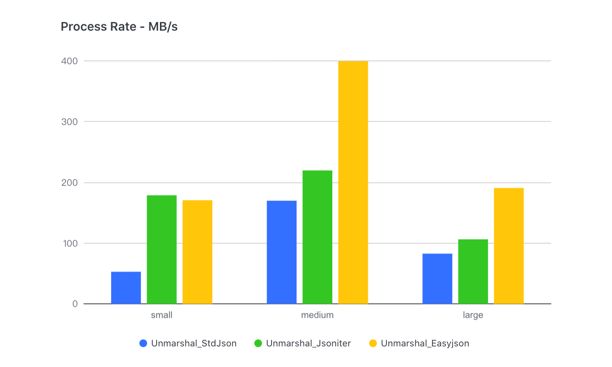
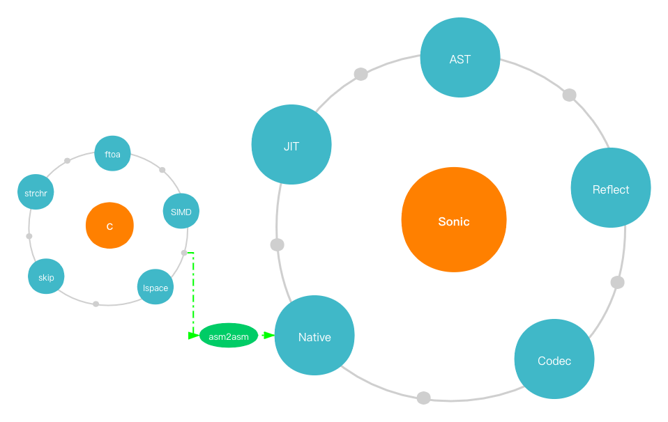

# Introduction to Sonic

English | [中文](INTRODUCTION_ZH_CN.md)

## Background
According to the overall profiling of production services in Bytedance, we found that the overhead of JSON serialization and deserialization is unexpectedly high: the total is near to 10% CPU, and the extreme one accounts for more than 40% CPU. Therefore, **the performance of JSON lib is a key issue for the promotion of machine utilization**.

## Research
We conducted a series of surveys and benchmarks on open-sourced JSON libraries for Golang, but the result is disappointing: **no silver bullet**. First of all, no one can perform at least the top three across various business scenarios. Even the most widely used [json-iterator](https://github.com/json-iterator/go) will severely degrade in generic (no-schema) or big-volume JSON serialization and deserialization. Secondly, compared with other JSON libraries writing in other languages, their speed is generally much slower. For example, [Simdjson-go](https://github.com/minio/simdjson-go) has a 50% reduction in decoding performance compared to [simdjson](https://github.com/simdjson/simdjson). What's more, we barely found JSON libraries which provide API to modify the underlying values.

Therefore, we decided to **develop a brand-new JSON library with high performance as well as wide applicability**.

## Thinking
Before starting our design, we need to figure out some questions:

### Why is Json-iterator faster than Standard Library?
First of all, the **schema-based processing mechanism** used by the standard library is commendable, in which the parser can obtain meta information in advance when scanning, thereby shortening the time of branch selection. However, its original implementation did not make good use of this mechanism, instead, **it spent a lot of time reflecting to obtain meta info of schema**. Meanwhile, The approach of json-iterator is: Interprete structure as field-by-field encoding and decoding functions, and then assembled and cached them, minimizing the performance loss cost by reflection. But does it work once and for all? No. In practical tests, we found that **the deeper and larger the input JSON got, the smaller the gap between json-iterator and other libraries gradually became** - eventually event got surpassed:
 

The reason is that **this implementation transforms into a large number of interface encapsulations and function calls**, followed by function-call losses:
1. **Calling interface involves dynamic addressing of itab**
2. **Assembly functions cannot be inlined**, while Golang's function-call performance is poor (no parameter-passing-by-register)

#### Is there a way to avoid the function-call overhead of dynamic assembly?
The first thing we thought about was code generation like [easyjson](https://github.com/mailru/easyjson). But it comes with **schema dependency and convenience losses**. To achieve a real drop-in replacement of the standard library, we turned to another technology - **[JIT](https://en.wikipedia.org/wiki/Jit) (just-in-time compiling)**. Because the compiled codec function is an integrated function, which can greatly reduce function calls while ensuring flexibility.

### Why is Simdjson-go not fast enough?
[SIMD](https://en.wikipedia.org/wiki/SIMD) (Single-Instruction-Multi-Data) is a special set of CPU instructions for the parallel processing of vectorized data. At present, it is supported by most CPUs and widely used in image processing and big data computing. Undoubtedly, SIMD is useful in JSON processing (itoa, char-search， and so on are all suitable scenarios). We can see that simdjson-go is very competitive in large JSON scenarios (>100KB). However, for some extremely small or irregular character strings, **the extra load operation required by SIMD will lead to performance degradation**. Therefore, we need to dedicate ourselves to branch predicting and decide which scenarios should use SIMD and which should not (for example, the string length is less than 16 bytes).

The second problem comes from the Go compiler itself. In order to ensure the compilation speed, **Golang does very little optimization work during the compilation phase** and cannot directly use compiler backends such as [LLVM](https://en.wikipedia.org/wiki/LLVM) (Low-Level Virtual Machine) for optimization.

So, **can some crucial calculation functions be written in another language with higher execution efficiency**?
C/Clang is an ideal compilation tool (internal integration LLVM). But the key is how to embed the optimized assembly into Golang.

### How to use Gjson well?
We also found that [gjson](https://github.com/tidwall/gjson) has a huge advantage in single-key lookup scenarios. This is because its lookup is implemented by a **lazy-load mechanism**, which subtlely skips passing-by values and effectively reduces a lot of unnecessary parsing. Practical application has proved that making good use of this feature in product can indeed bring benefits. But when it comes to multi-key lookup, Gjson does worse event than std,  which is a side effect of its skipping mechanism - **searching for the same path leads to repeated parsing** (skip is also a lightweight parsing). Therefore, the accurate adaptation of practical scenarios is the key.

## Design
Based on the above questions, our design is easy to implement:

1. Aiming at the function-call overhead cost by the codec dynamic-assembly, **`JIT` tech is used to assemble opcodes (asm) corresponding to the schema at runtime**, which is finally cached into the off-heap memory in the form of Golang functions.
2. For practical scenarios where big data and small data coexist, we **use pre-conditional judgment** (string size, floating precision, etc.) **to combine `SIMD` with scalar instructions** to achieve the best adaptation.
3. As for insufficiency in compiling optimization of go language, we decided to **use `C/Clang` to write and compile core computational functions**, and **developed a set of [asm2asm](https://github.com/chenzhuoyu/asm2asm) tools to translate the fully optimized x86 assembly into plan9** and finally load it into Golang runtime.
4. Giving the big speed gap between parsing and skipping, the **`lazy-load` mechanism** is certainly used in our AST parser, but in **a more adaptive and efficient way to reduce the overhead of multiple-key queries**.

In detail,  we conducted some further optimization:
1. Since the native-asm functions cannot be inlined in Golang, we found that its cost even exceeded the improvement brought by the optimization of the C compiler. So we reimplemented a set of lightweight function-calls in JIT:
    - `Global-function-table + static offset` for calling instruction
    - **Pass parameters using registers**
2. `Sync.Map` was used to cache the codecs at first, but for our **quasi-static** (read far more than write), **fewer elements** (usually no more than a few dozen) scenarios, its performance is not optimal, so we reimplement a high-performance and concurrent-safe cache with `open-addressing-hash + RCU` tech.
