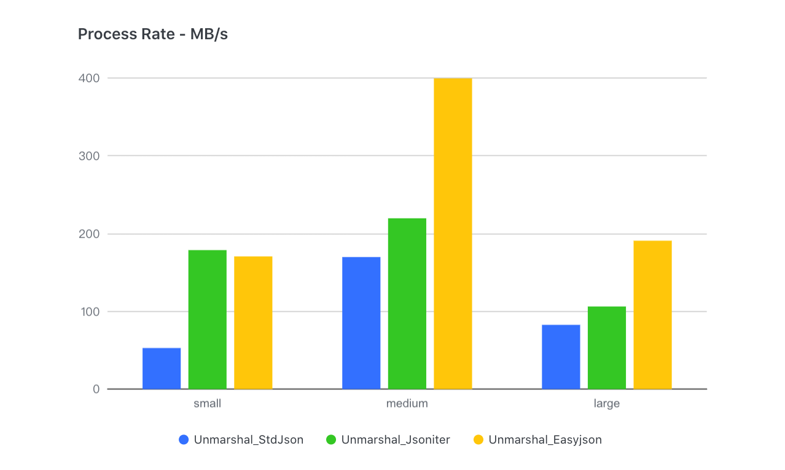
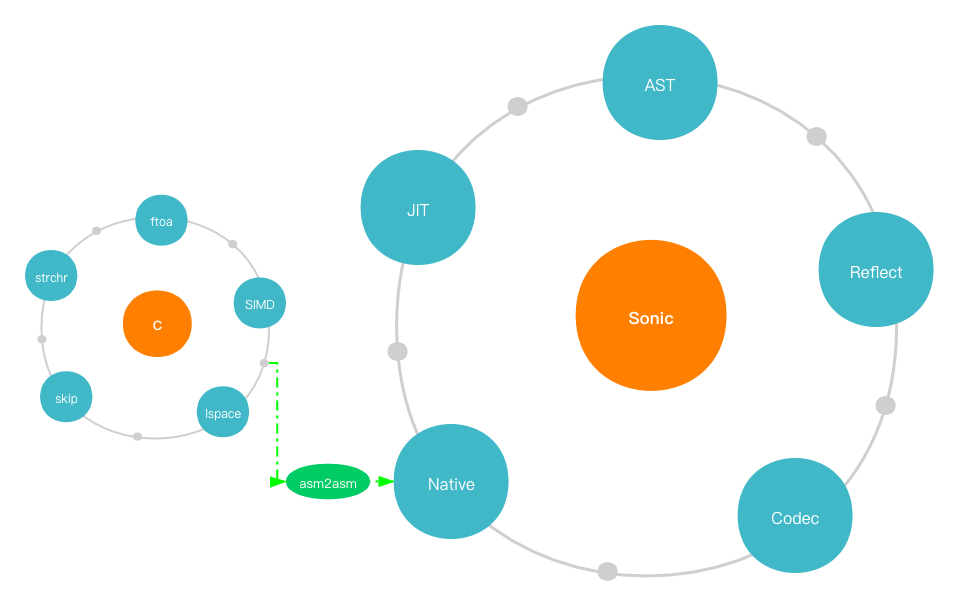

# Sonic 简介

[English](INTRODUCTION.md) | 中文

## 背景

根据字节跳动生产服务的整体分析，我们发现 JSON 序列化和反序列化的开销意外地很高：CPU 使用率接近 10%，其中极端情况下超过 40%。因此，**JSON 库的性能是提高机器利用率的关键问题**。

## 研究

我们对开源的 Golang JSON 库进行了一系列调研和基准测试，但结果令人失望：**没有万能的解决方案**。首先，没有一个库能够在各种业务场景中至少达到前三名。即使是最广泛使用的 [json-iterator](https://github.com/json-iterator/go) ，在通用（无模式）或大量 JSON 序列化和反序列化的情况下，性能也会严重下降。其次，与其他语言编写的 JSON 库相比，它们的速度通常要慢得多。例如，[Simdjson-go](https://github.com/minio/simdjson-go)的解码性能比[simdjson](https://github.com/simdjson/simdjson)低了 50%。而且，我们几乎找不到支持修改底层值的 JSON 库的 API。

因此，我们决定**开发一个全新的高性能、适用广泛的 JSON 库**。

## 设想

在开始设计之前，我们需要搞清楚一些问题：

### 为什么 Json-iterator 比标准库快？

首先，标准库使用的**基于模式(Schema)的处理机制**是值得称赞的，解析器可以在扫描时提前获取元信息，从而缩短分支选择的时间。然而，它的原始实现没有很好地利用这个机制，而是**花费了大量时间使用反射获取模式的元信息**。与此同时，json-iterator 的方法是：将结构解释为逐个字段的编码和解码函数，然后将它们组装和缓存起来，最小化反射带来的性能损失。但这种方法是否一劳永逸呢？实际测试中，我们发现**随着输入的 JSON 变深、变大，json-iterator 和其他库之间的差距逐渐缩小**——甚至最终被超越：
 

原因是**该实现转化为大量接口封装和函数调用**，导致了函数调用的性能损失：
1. **调用接口涉及到对 `itab` 的动态地址获取**
2. **组装的函数无法内联**，而 Golang 的函数调用性能较差（没有寄存器传参）

#### 有没有办法避免动态组装函数的调用开销？

我们首先考虑的是类似[easyjson](https://github.com/mailru/easyjson)的代码生成。但是这会带来**模式依赖和便利性下降**。为了实现对标准库的真正插拔式替换，我们转向了另一种技术- **[JIT](https://zh.wikipedia.org/zh-cn/即时编译) （即时编译）**。因为编译后的编解码函数是一个集成的函数，它可以大大减少函数调用，同时保证灵活性。

### 为什么 Simdjson-go 速度不够快？

[SIMD](https://en.wikipedia.org/wiki/SIMD) （单指令流多数据流）是一组特殊的 CPU 指令，用于并行处理矢量化数据。目前，大多数 CPU 都支持 SIMD ，并广泛用于图像处理和大数据计算。毫无疑问，SIMD在JSON处理中很有用（整形-字符串转换，字符搜索等都是合适的场景）。我们可以看到， simdjson-go 在大型 JSON 场景 (>100KB) 下非常有竞争力。然而，对于一些很小或不规则的字符字符串， **SIMD 所需的额外加载操作将导致性能下降**。因此，我们需要考虑不同的场景，并决定哪些场景应该使用 SIMD ，哪些不应该使用（例如，长度小于16字节的字符串）。

第二个问题来自 Go 编译器本身。为了保证编译速度， **Golang 在编译阶段几乎不进行任何优化工作**也无法直接使用编译器后端，如 [LLVM](https://en.wikipedia.org/wiki/LLVM) 等进行优化。

那么，**一些关键的计算函数能否用计算效率更高的其他语言编写吗**?

C/Clang 是一种理想的编译工具（内部集成了 LLVM ）。但关键是如何将优化后的汇编嵌入到 Golang 中。

### 如何更好地使用 `Gjson` ？
我们还发现在单键查找场景中， [gjson](https://github.com/tidwall/gjson)具有巨大的优势。这是因为它的查找是通过**惰性加载机制**实现的，巧妙地跳过了传递的值，并有效的减少了许多不必要的解析。实际应用证明，在产品中充分利用这个特性确实能带来收益。但是，当涉及到多键查找时，Gjson甚至比标准库还要差，这是其跳过机制的副作用——**搜索相同路径会导致重复解析**（跳过解析也是一种轻量的解析）因此，根据实际情况准确的做出调整是关键问题。

## 设计

基于以上问题，我们的设计很好实现：

1. 针对编解码动态汇编的函数调用开销，我们**使用 JIT 技术在运行时组装与模式对应的字节码（汇编指令）**，最终将其以 Golang 函数的形式缓存在堆外内存上。
2. 针对大数据和小数据共存的实际场景，我们**使用预处理判断**（字符串大小、浮点数精度等）**将 SIMD 与标量指令相结合**，从而实现对实际情况的最佳适应。
3. 对于 Golang 语言编译优化的不足，我们决定**使用 C/Clang 编写和编译核心计算函数**，并且**开发了一套 [asm2asm](https://github.com/chenzhuoyu/asm2asm) 工具，将经过充分优化的 x86 汇编代码转换为 Plan9 格式**，最终加载到 Golang 运行时中。
4. 考虑到解析和跳过解析之间的速度差异很大， **惰性加载机制**当然也在我们的 AST 解析器中使用了，但**以一种更具适应性和高效性的方式来降低多键查询的开销**。

在细节上，我们进行了一些进一步的优化：
1. 由于 Golang 中的原生汇编函数不能被内联，我们发现其成本甚至超过了 C 编译器的优化所带来的改善。所以我们在 JIT 中重新实现了一组轻量级的函数调用：
    - 全局函数表+静态偏移量，用于调用指令
    - **使用寄存器传递参数**
2. `Sync.Map` 一开始被用来缓存编解码器，但是对于我们的**准静态**（读远多于写），**元素较少**（通常不足几十个）的场景，它的性能并不理想，所以我们使用开放寻址哈希和 RCU 技术重新实现了一个高性能且并发安全的缓存。
